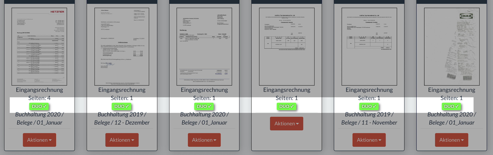

## mayan2duo - Mayan-EDMS to DATEV Unternehmen Online

This is a small microservice that monitors document types in [mayan-edms](https://gitlab.com/mayan-edms/mayan-edms) that are configurable in the service config and pushes them to DATEV Unternehmen Online (DUO) using the email import.
If a push/sending was successful the documents get a configurable done-tag like in the screenshot below.


### What can i do with this software?

For this we can provide an example:
In your daily business you get many documents via email, postal service etc.
We use mayan-edms to archive every single document in a central place.
This has also many benefits since mayan is doing OCR and full-text-indexing you can search on the documents and find what you need in a few seconds.
This is much faster than searching for a document in your paper directories.
It's also nice because you could work from everywhere on the world or lookup some documents if you're not in our office.
You also save much space and don't have any vendor-lock-ins since you are the owner of your documents and DMS.

While using mayan-edms for your company or yourself works fine, most tax-consultants don't get along with it.
The tool most tax-consultants are using is DATEV and especially to get the invoices, statements, reciepts from their clients they prefer _DATEV Unternehmen Online_ because it plays nicely with the DATEV consultancy software products.

Because of this we've built this microservice. You can define for example 3 document types like:
- invoice receipt
- bank account statement
- credit note document

You can add these types to mayan-edms and DATEV Unternehmen Online (DUO).
Within DUO you can configure an email import for each document type and you get 3 different e-mail addresses (inboxes).

Now you can configure this service to obtain all 3 document types from mayan-edms and push them to the correct inbox for DUO.
DUO will automatically import them with the correct document type classification.

So you only have to classify a document once while importing to mayan-edms and this can already be done on your scanner using some tags or configuring your sources in mayan-edms to do that automatically.
Once this is set up, you have much time savings since in the best case everything works automatically.
You could also classify your documents directly within your mail inbox. In Gmail for example you can create filters for "contains invoice and has attachment", label that messages and move them into an imap directory.
Let mayan-edms obtain this directory knowing that these emails contain "invoices" and directly assign the document-type "invoice receipt".
Since you've running mayan2duo this invoice receipt will also be pushed to DUO and everything is done.

### Setup & Getting started
##### Using Docker
```
docker run \
-d \
--name mayan2duo \
--restart=always \
-e MAYAN_API_BASEURL='https://your-url-to-mayan.tld/api' \
-e MAYAN_API_USERNAME=mayan-technical-username \
-e MAYAN_API_PASSWORD=mayan-technical-password \
-e MAYAN2DUO_FIXEDDELAY=60000 \
-e MAYAN2DUO_TAGS_DONEID=1 \
-e MAYAN2DUO_MAPPING='{1: "your-datev-type1-email@datevimport.tld", 5: "your-datev-type5-email@datevimport.tld"}' \
-e MAIL_HOST=your-email-host \
-e MAIL_PROTOCOL=smtp \
-e MAIL_TLS=true \
-e MAIL_AUTH=true \
-e MAIL_PORT=587 \
-e MAIL_USERNAME=your-email-username \
-e MAIL_PASSWORD=your-email-password \
registry.gitlab.com/encircle360-oss/mayan2duo:latest
```

### Benefits
In the best case you've always directly all important documents you specified by type in DUO and mayan-edms.
In our case we push only the accounting relevant document types to DUO.

This is open source software by [encircle360](https://encircle360.com). Licence will be published soon.
